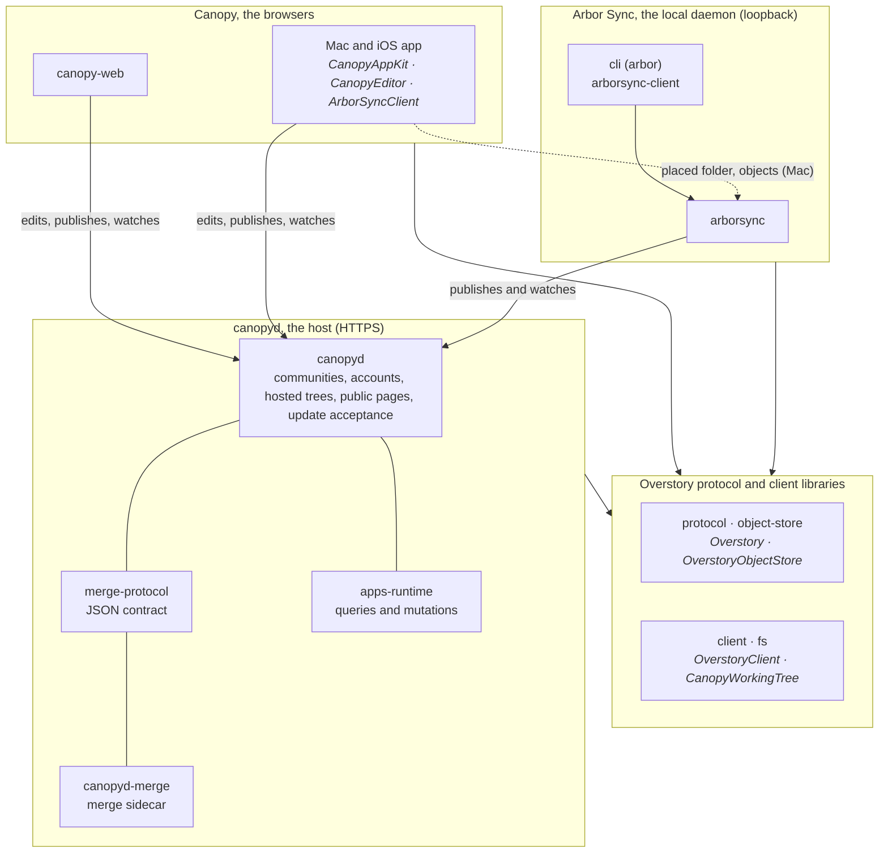

# Overstory

Overstory turns ordinary folders into a shared, browsable space for people and
agents. Files stay files: readable with `cat`, searchable with `grep`, and
editable by any existing tool. A folder can gain a stable identity, history,
synchronization, and permissions without moving into a walled service, and
the Canopy browsers give the same material a human interface.

The longer-term idea is that documents in this space can also become live
applications: their data, interface, and permitted operations travel
together instead of being split across a website, API, database, and account
system. The reference implementation provides the protocol in two languages,
a host, a local sync daemon and CLI, the native browser, and the headless
data runtime. Executable-document presentation, hosted agents, and portable
deployment remain work in progress or specification only.

For the longer argument, read [A universal dynamic material](docs/getting-started/intro.md).
For the exact current boundary, see [status.md](status.md).

## How it fits together

Four components, two languages. TypeScript packages live under `packages/`
as `@overstory/<name>`; Swift packages live under `swift/Packages/`.

- **The Overstory protocol**: the specification in code, plus the libraries
  every participant uses to hold and synchronize a tree.
  `protocol`, `object-store`, `client`, `fs`; Swift `Overstory`,
  `OverstoryObjectStore`, `OverstoryClient`, `CanopyWorkingTree`.
- **canopyd, the host**: serves communities, accounts, hosted trees, and
  public pages over HTTPS, accepts updates, and runs two sidecars: the merge
  tool for every accepted update and the executable-document runtime for
  queries and mutations. `canopyd`, `canopyd-merge`, `merge-protocol` (the JSON contract
  between the two), `apps-runtime`.
- **Arbor Sync, the local daemon**, with the `arbor` command: keeps placed
  folders on a Mac synchronized with their hosts and serves them to local
  clients over loopback. `arborsync`, `arborsync-client`, `cli`;
  Swift `ArborSyncClient`.
- **Canopy, the browsers**: the human interface. The Mac and iOS app edits
  working trees directly against a host; on the Mac it also uses the daemon
  for the placed folder. The browser editor is being rebuilt to talk to a
  host the same way. Swift `CanopyAppKit`, `CanopyEditor`, the app target;
  `canopy-web`.



## Getting started

Today the only editor is the Canopy app for macOS and iOS, built from
`swift/`; the browser editor is being rebuilt. So the path from a checkout
to a synchronized folder runs through the app once, to claim an account.
The setup below is for macOS.

**1. Make an identity.** From a checkout, install the dependencies, expose
the commands in your shell, and create one local profile:

```sh
bun install
bun link
arbor me create
arbor me
```

`arbor me` prints your public profile TreeID (`tr_…`). It is the only thing
another host needs to know about you; the private key never leaves the
profile folder. `arbor me create` is a one-time operation and refuses to
replace an existing identity.

**2. Get an account on a host.** Either join an existing community or run
your own.

- *Join:* send your TreeID to the community's administrator. They add you as
  a member of the community profile with a handle, which reserves the
  account `https://garden.example/~you` for that exact profile; nobody else
  can claim it. Membership is authored content: an entry in the community
  tree's `members:` list with your `profile: arbor://tr_…/` and `handle`.
- *Run your own:* create a community whose founder account is reserved for
  your profile, then serve it:

  ```sh
  canopyd init garden --founder joe=tr_…
  canopyd serve garden
  ```

  `serve` listens at `http://127.0.0.1:4318` and prints the founder's
  reserved account URL on every start until it is claimed. For a public
  domain, persistent volumes, backups, and upgrades, use the
  [deployment guide](packages/canopyd/deploy/README.md).

**3. Claim it from Canopy.** Build the app (`xcodegen generate --spec
swift/project.yml --project swift`, then the `Canopy` scheme; see
[swift/README.md](swift/README.md)), open the reserved account URL in it, and
choose **Claim profile**. The app proves your profile to the host and
installs the account configuration under `~/.arbor`.

**4. Place a folder.** Install Arbor Sync as a user service and publish a
folder at a path under your account:

```sh
arbor daemon install
arbor place ./notes https://garden.example/~joe/notes
```

The folder stays where it is and becomes a synchronized tree: the daemon
pushes your edits, materializes everyone else's, and the app edits it in
place. `arbor status` shows every placement; the [CLI reference](docs/getting-started/cli.md)
covers moves, sharing, identity backup and restore, cloud sessions, and the
command safety rules. Linux and Windows daemon supervision are not
implemented yet.

## Status

| State | Today |
|---|---|
| **Implemented** | Tree identity and synchronization in both languages, canopyd with the merge sidecar and resource policy, the Canopy app as a direct working-tree editor with recovery and conflict review, profile and account claiming, multi-account configuration and pairing, cloud sessions, the SQLite-backed query and mutation core |
| **In progress** | The browser Canopy, executable-document compilation and presentation, richer editor capture and review, lazy history and storage bounds |
| **Specified, not built** | Hosted agents, portable static and live deployment, a complete Postgres child provider |

[status.md](status.md) is the authority, row by row. The [specification](docs/overstory-spec/README.md)
describes portable behavior that may not exist in the reference
implementation yet.

## Repository map

| Path | What it is |
|---|---|
| [`status.md`](status.md) | What the reference implementation does today |
| [`packages/`](packages/README.md) | The TypeScript workspace: protocol, host, client stack, Arbor tools, browser editor. The host's [deployment guide](packages/canopyd/deploy/README.md) and [migrations](packages/canopyd/migrations/README.md) live with it |
| [`swift/`](swift/README.md) | The Swift packages and the Canopy app for macOS and iOS |
| [`docs/`](docs/README.md) | Getting started, the Overstory specification and conformance fixtures, implementing editors, implementing sync services, and architecture by subcomponent |
| [`tests/`](tests/README.md) | Bun unit, integration, protocol, and performance suites and their fixtures |
| [`examples/`](examples/supplies/README.md) | The Supplies corpus: the executable-document reference application |
| [`plans/`](plans/README.md) | Remaining work: the outcome menu, the catalog, open questions |
| [`DEVELOPMENT.md`](DEVELOPMENT.md), [`AGENTS.md`](AGENTS.md) | How the repository is worked on: setup, ownership, change discipline, gates; and the short list of things that differ for agents |

This repository does not yet have an open-source license, so contributions
cannot be accepted yet; licensing is awaiting legal advice. [DEVELOPMENT.md](DEVELOPMENT.md)
describes how the repository is worked on.
