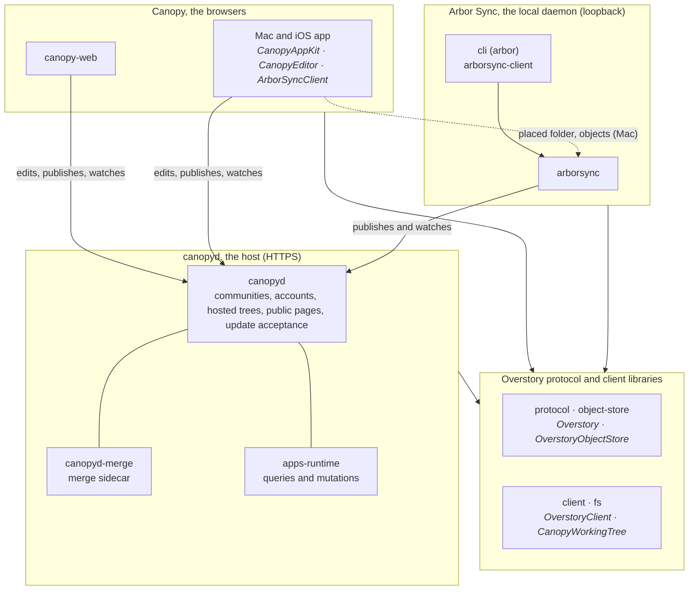

# Overstory

Overstory turns ordinary folders into a shared, browsable space for people and
agents. Files stay files: readable with `cat`, searchable with `grep`, and
editable by any existing tool. A folder can gain a stable identity, history,
synchronization, and permissions without moving into a walled service, and
the Canopy browsers give the same material a human interface.

The longer-term idea is that documents in this space can also become live
applications: their data, interface, and permitted operations travel
together instead of being split across a website, API, database, and account
system. The reference implementation provides the protocol in two languages,
a host, a local sync daemon and CLI, the native browser, and the headless
data runtime. Executable-document presentation, hosted agents, and portable
deployment remain work in progress or specification only.

For the longer argument, read [A universal dynamic material](docs/intro.md).
For the exact current boundary, see [status.md](status.md).

## How it fits together

Four components, two languages. TypeScript packages live under `packages/`
as `@overstory/<name>`; Swift packages live under `swift/Packages/`.

- **The Overstory protocol**: the specification in code, plus the libraries
  every participant uses to hold and synchronize a tree.
  `protocol`, `object-store`, `client`, `fs`; Swift `Overstory`,
  `OverstoryObjectStore`, `OverstoryClient`, `CanopyWorkingTree`.
- **canopyd, the host**: serves communities, accounts, hosted trees, and
  public pages over HTTPS, accepts updates, and runs two sidecars: the merge
  tool for every accepted update and the executable-document runtime for
  queries and mutations. `canopyd`, `canopyd-merge`, `apps-runtime`.
- **Arbor Sync, the local daemon**, with the `arbor` command: keeps placed
  folders on a Mac synchronized with their hosts and serves them to local
  clients over loopback. `arborsync`, `arborsync-client`, `cli`;
  Swift `ArborSyncClient`.
- **Canopy, the browsers**: the human interface. The Mac and iOS app edits
  working trees directly against a host; on the Mac it also uses the daemon
  for the placed folder. The browser editor is being rebuilt to talk to a
  host the same way. Swift `CanopyAppKit`, `CanopyEditor`, the app target;
  `canopy-web`.



## Start using Overstory

The current persistent setup is for macOS. From a checkout, install the
dependencies, expose the commands in your shell, install Arbor Sync as a user
service, create one local profile identity, and open the current folder:

```sh
bun install
bun link
arbor daemon install
arbor me create
arbor open .
```

`bun link` exposes `arbor`, `arborsync`, `canopyd`, and `arbor-merge` from
this checkout. `arbor daemon install` installs and starts the per-user Arbor
Sync launchd service; if the signed Canopy app already owns that service, the
command leaves its registration in place. `arbor me create` is a one-time
operation and refuses to replace an existing identity.

`arbor open` accepts a local path, a canonical HTTPS or `arbor://` URL, or no
locator for the current directory. Until the browser editor returns, the
browser route serves a short notice; edit in the Canopy app. Linux and Windows
daemon supervision are not implemented yet. The [CLI reference](docs/cli.md)
covers daemon setup, placing synchronized trees, moves, identity backup and
restore, cloud sessions, and command safety rules.

## Run a host

A new community reserves its first account for an existing self-certifying
profile. Print the profile TreeID created above:

```sh
arbor me
```

Then create the community, naming the founder account and the profile that
alone may claim it, and serve it:

```sh
canopyd init garden --founder joe=tr_...
canopyd serve garden
```

`init` writes the community into `./garden` (or `--data <directory>`) and
runs once; `serve` listens at `http://127.0.0.1:4318` by default and prints
the founder's reserved account URL on every start until it is claimed. In
another terminal, open and claim it:

```sh
arbor open http://127.0.0.1:4318/~joe
```

For public domains, persistent volumes, backups,
restoration, and coordinated upgrades, use the [deployment guide](packages/canopyd/deploy/README.md).

## Status

| State | Today |
|---|---|
| **Implemented** | Tree identity and synchronization in both languages, canopyd with the merge sidecar and resource policy, the Canopy app as a direct working-tree editor with recovery and conflict review, profile and account claiming, multi-account configuration and pairing, cloud sessions, the SQLite-backed query and mutation core |
| **In progress** | The browser Canopy, executable-document compilation and presentation, richer editor capture and review, lazy history and storage bounds |
| **Specified, not built** | Hosted agents, portable static and live deployment, a complete Postgres child provider |

[status.md](status.md) is the authority, row by row. The [specification](spec/README.md)
describes portable behavior that may not exist in the reference
implementation yet.

## Repository map

| Path | What it is |
|---|---|
| [`spec/`](spec/README.md) | The portable specification: entry page, numbered sections, and the conformance vectors both implementations must pass |
| [`status.md`](status.md) | What the reference implementation does today |
| [`packages/`](packages/README.md) | The TypeScript workspace: protocol, host, client stack, Arbor tools, browser editor. The host's [deployment guide](packages/canopyd/deploy/README.md) and [migrations](packages/canopyd/migrations/README.md) live with it |
| [`swift/`](swift/README.md) | The Swift packages and the Canopy app for macOS and iOS |
| [`docs/`](docs/README.md) | Usage and implementation documentation, organized by component: `canopyd/`, `arborsync/`, `canopy-browser/`, plus the CLI reference, the architecture overview, and the introduction |
| [`tests/`](tests/README.md) | Bun unit, integration, protocol, and performance suites and their fixtures |
| [`examples/`](examples/supplies/README.md) | The Supplies corpus: the executable-document reference application |
| [`plans/`](plans/README.md) | Remaining work: the outcome menu, the catalog, open questions |
| [`DEVELOPMENT.md`](DEVELOPMENT.md), [`AGENTS.md`](AGENTS.md) | How the repository is worked on: setup, ownership, change discipline, gates; and the short list of things that differ for agents |

This repository does not yet have an open-source license, so contributions
cannot be accepted yet; licensing is awaiting legal advice. [DEVELOPMENT.md](DEVELOPMENT.md)
describes how the repository is worked on.
