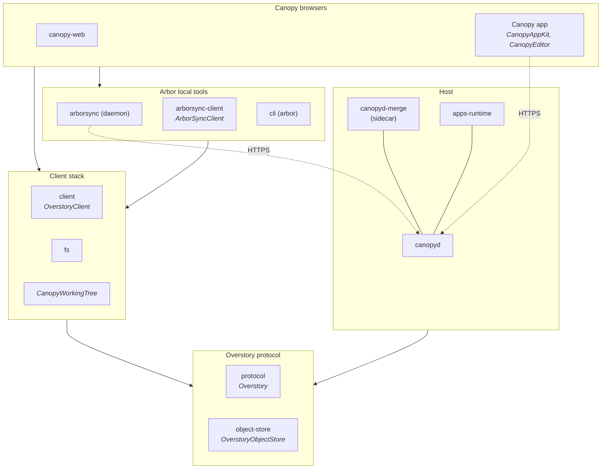

# Overstory

Overstory turns ordinary folders into a shared, browsable space for people and
agents. Files stay files: readable with `cat`, searchable with `grep`, and
editable by any existing tool. A folder can gain a stable identity, history,
synchronization, and permissions without moving into a walled service, and
the Canopy browsers give the same material a human interface.

The longer-term idea is that documents in this space can also become live
applications: their data, interface, and permitted operations travel
together instead of being split across a website, API, database, and account
system. The reference implementation provides the protocol in two languages,
a host, a local sync daemon and CLI, the native browser, and the headless
data runtime. Executable-document presentation, hosted agents, and portable
deployment remain work in progress or specification only.

For the longer argument, read [A universal dynamic material](docs/intro.md).
For the exact current boundary, see [status.md](status.md).

## How it fits together



Names in italics are the Swift packages under `swift/`; the rest are
TypeScript packages under `packages/`, published as `@overstory/<name>`.

- **The protocol** (`protocol`, `object-store`) is the specification in code:
  identifiers, the node model, canonical CBOR, objects and snapshots, update
  contracts, resource policy, the document format, configuration formats, and
  the HTTP transport. It depends on nothing else in the repository.
- **The host** (`canopyd`) serves communities, accounts, hosted trees, and
  public pages. It runs the merge sidecar (`canopyd-merge`) for every
  accepted update and the executable-document runtime (`apps-runtime`) for
  queries and mutations.
- **The client stack** (`client`, `fs`, `CanopyWorkingTree`) synchronizes a
  working tree against a host: the update machine, the source admission
  queue, and filesystem materialization.
- **The Arbor local tools** (`arborsync`, `arborsync-client`, `cli`) are the
  per-user daemon that keeps placed folders synchronized, its loopback API,
  and the `arbor` command.
- **The Canopy browsers** (`swift/`, `canopy-web`) are the human
  interface: the Mac and iOS app, and the browser editor that is being
  rebuilt on the same working tree.

## Start using Overstory

The current persistent setup is for macOS. From a checkout, install the
dependencies, expose the commands in your shell, install Arbor Sync as a user
service, create one local profile identity, and open the current folder:

```sh
bun install
bun link
arbor daemon install
arbor me create
arbor open .
```

`bun link` exposes `arbor`, `arborsync`, `canopyd`, and `arbor-merge` from
this checkout. `arbor daemon install` installs and starts the per-user Arbor
Sync launchd service; if the signed Canopy app already owns that service, the
command leaves its registration in place. `arbor me create` is a one-time
operation and refuses to replace an existing identity.

`arbor open` accepts a local path, a canonical HTTPS or `arbor://` URL, or no
locator for the current directory. Until the browser editor returns, the
browser route serves a short notice; edit in the Canopy app. Linux and Windows
daemon supervision are not implemented yet. The [CLI reference](docs/arborsync/cli.md)
covers daemon setup, placing synchronized trees, moves, identity backup and
restore, cloud sessions, and command safety rules.

## Run a host

A new community reserves its first account for an existing self-certifying
profile. Print the profile TreeID created above:

```sh
arbor me
```

Then start canopyd, replacing `tr_...` with that TreeID:

```sh
canopyd ./garden \
  --community garden \
  --first-writer joe \
  --first-writer-profile tr_...
```

canopyd listens at `http://127.0.0.1:4318` by default and prints the reserved
account URL. In another terminal, open and claim it:

```sh
arbor open http://127.0.0.1:4318/~joe
```

Restarting the same command serves the existing data directory without
bootstrapping again. For public domains, persistent volumes, backups,
restoration, and coordinated upgrades, use the [deployment guide](packages/canopyd/deploy/README.md).

## Status

| State | Today |
|---|---|
| **Implemented** | Tree identity and synchronization in both languages, canopyd with the merge sidecar and resource policy, the Canopy app as a direct working-tree editor with recovery and conflict review, profile and account claiming, multi-account configuration and pairing, cloud sessions, the SQLite-backed query and mutation core |
| **In progress** | The browser Canopy, executable-document compilation and presentation, richer editor capture and review, lazy history and storage bounds |
| **Specified, not built** | Hosted agents, portable static and live deployment, a complete Postgres child provider |

[status.md](status.md) is the authority, row by row. The [specification](spec/README.md)
describes portable behavior that may not exist in the reference
implementation yet.

## Repository map

| Path | What it is |
|---|---|
| [`spec/`](spec/README.md) | The portable specification: entry page, numbered sections, and the conformance vectors both implementations must pass |
| [`status.md`](status.md) | What the reference implementation does today |
| [`packages/`](packages/README.md) | The TypeScript workspace: protocol, host, client stack, Arbor tools, browser editor. The host's [deployment guide](packages/canopyd/deploy/README.md) and [migrations](packages/canopyd/migrations/README.md) live with it |
| [`swift/`](swift/README.md) | The Swift packages and the Canopy app for macOS and iOS |
| [`docs/`](docs/README.md) | Usage and implementation documentation, organized by component: `canopyd/`, `arborsync/`, `canopy/`, plus the architecture overview, the shared update machine, and the introduction |
| [`tests/`](tests/README.md) | Bun unit, integration, protocol, and performance suites and their fixtures |
| [`examples/`](examples/supplies/README.md) | The Supplies corpus: the executable-document reference application |
| [`plans/`](plans/README.md) | Remaining work: the outcome menu, the catalog, open questions |
| [`DEVELOPMENT.md`](DEVELOPMENT.md), [`AGENTS.md`](AGENTS.md) | How the repository is worked on: setup, ownership, change discipline, gates; and the short list of things that differ for agents |

This repository does not yet have an open-source license, so contributions
cannot be accepted yet; licensing is awaiting legal advice. [DEVELOPMENT.md](DEVELOPMENT.md)
describes how the repository is worked on.
